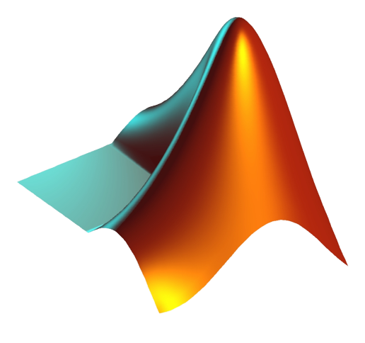

<h1> Hey, I’m Muhammad Ali </h1>

  👀 I am CS student pursuing minors in ECE and Mathematics  
  🤖 My interests lie in Machine Learning, Robotics and Computer Vision  
  📫 alimuhammad7465@gmail.com   
  🕸️ <a href = "https://www.linkedin.com/in/muhammad-a1i/">My Resume</a>

  

 
 
 

  
<!--   
  
  
  
   -->
  
  
 <!--- 
  ) --->

 

## 👩‍💻 Tech Stack
### Languages and tools I work with

 

### Some Libararies I work with

## 📈 Profile Stats

  
           

  

<a href="https://lovepik.com/images/png-hacking.html">vector by Lovepik.com</a>
<!---
muhammadali74/muhammadali74 is a ✨ special ✨ repository because its `README.md` (this file) appears on your GitHub profile.
You can click the Preview link to take a look at your changes.
--->
